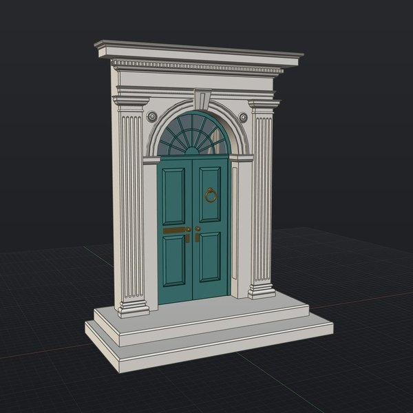
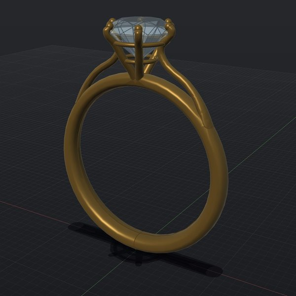
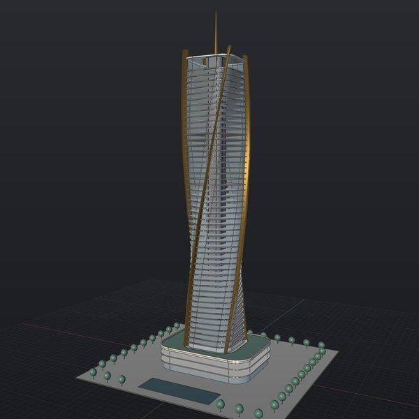
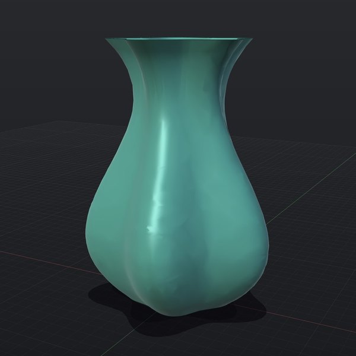
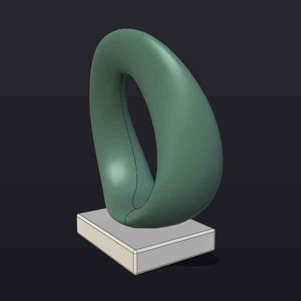
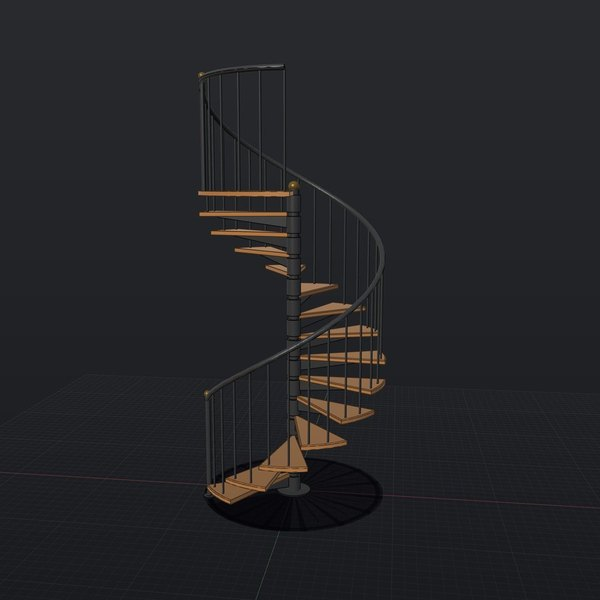
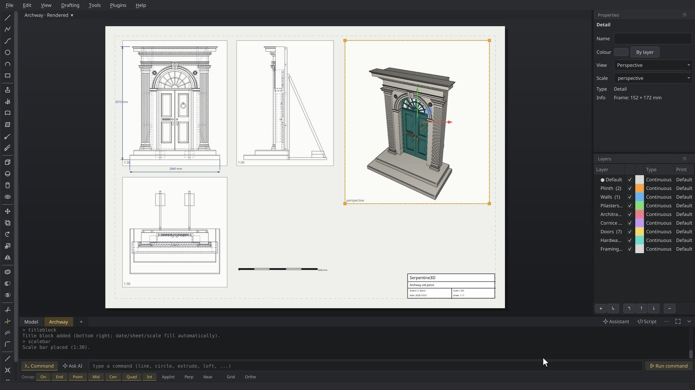
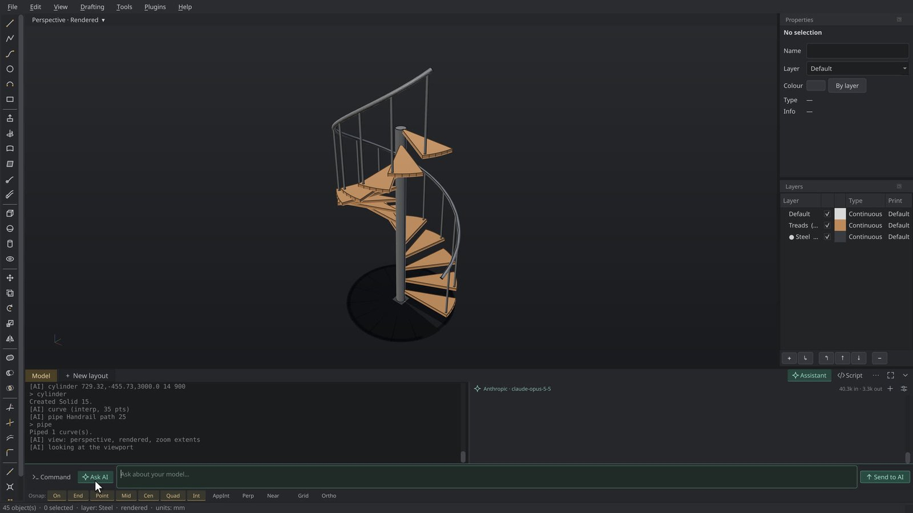

<div align="center">


# Serpentine3D

**The open-source NURBS modeller for things that get built.**<br>
Exact curves and surfaces, drawing sheets a workshop can build from, a command
line that speaks Rhino, and an assistant that can drive all of it.<br>
Linux, Windows and macOS. Free, with no account.

[**Download**](#download) · [Website](https://chisomobanzi.github.io/Serpentine3D/) · [Documentation](https://chisomobanzi.github.io/Serpentine3D/docs/) · [Coming from Rhino?](docs/coming-from-rhino.md)

</div>

https://github.com/user-attachments/assets/837002ba-7780-49d3-b966-71d6469ba884

## Made in Serpentine3D

<table>
<tr>
<td width="33%"></td>
<td width="33%"></td>
<td width="33%"></td>
</tr>
<tr>
<td><sub><b>Film and TV</b> · an archway set piece, 35 objects on 8 layers</sub></td>
<td><sub><b>Jewellery</b> · a cathedral solitaire with a 57-facet brilliant</sub></td>
<td><sub><b>Architecture</b> · 50 storeys turning a quarter turn</sub></td>
</tr>
<tr>
<td></td>
<td></td>
<td></td>
</tr>
<tr>
<td><sub><b>Product design</b> · one surface lofted through four curves</sub></td>
<td><sub><b>Sculpture</b> · a pierced loop in serpentine stone</sub></td>
<td><sub><b>Interiors</b> · a spiral stair, 14 oak treads</sub></td>
</tr>
</table>

## What it does

- **Exact geometry.** NURBS curves, surfaces and solids on the OpenCASCADE
  kernel, not meshes. Rhino `.3dm`, STEP, DXF, SVG, OBJ, FBX and STL in and
  out; glTF, USD and 3MF out; E57 point clouds in.
- **A command line that speaks Rhino.** `loft`, `sweep2`, `filletedge`,
  `booleanunion` and more than 200 others, with Rhino's aliases, object
  snaps, layers and a gumball that pushes faces and rounds edges by hand.
- **Drawings from the model.** A4 to A0 sheets with live detail views,
  hidden-line views, dimensions, hatching and title blocks, printed to
  vector PDF.
- **An assistant that can see.** Describe a change and it runs the commands,
  looks at the viewport to check its work and fixes its own mistakes, all
  undoable. Use Claude, a ChatGPT account, an OpenAI key, or a local,
  open-weight model.
- **Headless.** Script it in the built-in editor, batch it with
  `serp3d-batch`, or let any MCP client drive a live session.
- **Checks before you build.** Zebra stripes, curvature, draft analysis and
  `printcheck` for 3D printing.

<table>
<tr>
<td width="50%"></td>
<td width="50%"></td>
</tr>
<tr>
<td align="center"><sub>The archway on an A3 sheet, drawn from the model</sub></td>
<td align="center"><sub>The assistant building a spiral stair</sub></td>
</tr>
</table>

## Download

| Platform | Download | Size | Notes |
|---|---|---|---|
| **Linux** | [Serpentine3D-x86_64.AppImage](https://github.com/chisomobanzi/Serpentine3D/releases/latest/download/Serpentine3D-x86_64.AppImage) | 509&nbsp;MB | Make it executable and run it. Nothing to install. |
| **Windows** | [Serpentine3D-Setup-x86_64.exe](https://github.com/chisomobanzi/Serpentine3D/releases/latest/download/Serpentine3D-Setup-x86_64.exe) | 119&nbsp;MB | Unsigned for now: choose **More info**, then **Run anyway**. |
| **macOS** | [Serpentine3D-0.10.9-arm64.dmg](https://github.com/chisomobanzi/Serpentine3D/releases/latest/download/Serpentine3D-0.10.9-arm64.dmg) | 268&nbsp;MB | Apple Silicon. Unsigned for now: right-click the app and choose **Open**. |

Each build carries the OpenCASCADE kernel and its own Python, and needs a GPU
with OpenGL 3.3. Headless use works anywhere. [Release notes](https://github.com/chisomobanzi/Serpentine3D/releases/latest)

## Script it

```python
# make_part.py, run with: serp3d-batch make_part.py crate.step
box = doc.add(geo.make_box((0, 0, 0), 100, 100, 100), name="Crate")
doc.run("filletedge", ["Crate", "", "5"])
doc.export(args[0] if args else "crate.step")
```

`doc.run` drives any command by answering its prompts. More in the
[scripting guide](docs/howto/scripting.md) and the
[assistant and MCP guide](docs/howto/ai-mcp.md).

## Documentation

| Start here | How-to | Reference |
|---|---|---|
| [Install](docs/getstarted/install.md) | [Drawings](docs/howto/drawings.md) | [Commands](docs/reference/commands.md) |
| [Your first model](docs/getstarted/first-model.md) | [Scripting](docs/howto/scripting.md) | [File formats](docs/reference/file-formats.md) |
| [Coming from Rhino](docs/coming-from-rhino.md) | [Assistant and MCP](docs/howto/ai-mcp.md) | [Keyboard](docs/reference/keyboard.md) |
| | [3D printing](docs/howto/3d-printing.md) | [How it works](docs/explanation/how-it-works.md) |

## Build from source

```bash
git clone https://github.com/chisomobanzi/Serpentine3D && cd Serpentine3D
python3 -m venv .venv && .venv/bin/pip install -e ".[dev]"
.venv/bin/serp3d        # the app
.venv/bin/pytest        # the tests
```

Python 3.10 or later. The kernel installs as pip wheels (`cadquery-ocp`), with
no conda and no system packages, on Linux, Windows and macOS alike.

## Support

Serpentine3D is free and always will be: no subscription, no licence server, no
"upgrade to Pro". One person builds it between other work. If it is useful to
you, [a small contribution on Ko-fi](https://ko-fi.com/chisomobanzi/?hidefeed=true&widget=true&embed=true&preview=true) keeps it
moving.

Bug reports, sample files and documentation fixes are worth as much and cost
nothing: see [CONTRIBUTING.md](CONTRIBUTING.md), and
[Not here yet](docs/coming-from-rhino.md#not-here-yet) for what is missing.

Named after the serpentine stone of Zimbabwean Shona sculpture, and the S-curve
at the heart of NURBS geometry. MIT licensed.
